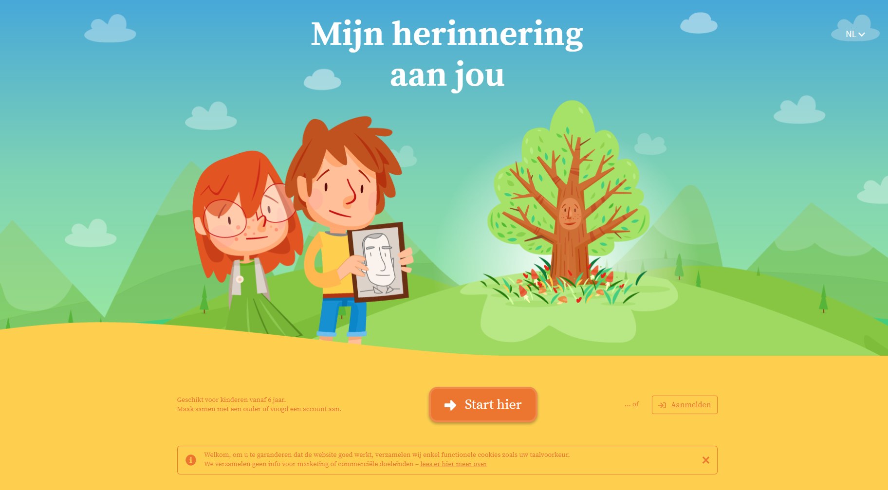
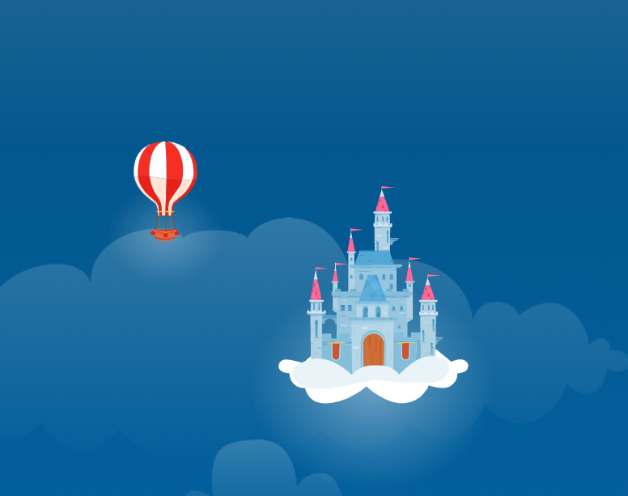

# Verslag gastcollege Starring Jane

Starring Jane heeft 2 mensen gestuurd namelijk: 

Laurens Bultynck & Thomas Seyssens. Zij wisten meer te vertellen over :
*	Het Bedrijf
*	Waarom Vue
*	Aanpak bij eigen project
*	Uitdagingen in het project
*	Voorbeelden in het project
*	Feedback

## Het bedrijf
Er werd mooie foto’s getoond over wat hun bedrijf gedaan heeft. Zo toonden ze welke reizen ze al achter de rug gehad hebben. Daarna vertelden ze over wat zij dagelijks moeten doen.

## Waarom Vue?
Het eerste wat het bedrijf ons wist te vertellen over Vue is dat Vue een lage leercurve heeft. Met andere woorden: Vue is niet zo moeilijk om te leren. Vue maakt ook gebruik van observables. Daarnaast is vue gemakkelijk om offline te laten draaien. Wanneer een stuk code werd getoond kon je mooi zien waarover ze spraken. Je zag ook mooi de verschillende componenten. Zij spraken over verschillende componenten, die je duidelijk kon zien. In hun voorbeeld kon je duidelijk de componenten: world – sky – baloon - … zien.

## Aanpak van project
### Wat is hun project?
https://www.ketnet.be/Karrewiet/1-november-2018-allerheiligen

Deze link toont het perfecte voorbeeld van wat Starring Jane gemaakt heeft.  In dit projecten was het idee om kinderen hun verlies van een opa, mama of zelfs huisdier te kunnen verwerken. Zo hebben ze een boom gemaakt wat het tegenovergestelde is van gestorven. Een levende boom waar je blaadjes kan aan hangen. In elk blaadje kan je een herinnering plaatsen.
https://mijnherinneringaanjou.be/#/ 

## Hoe is het project aangepakt?
Eerst hebben ze bekeken wat de meeste succes factoren zijn. Bijvoorbeeld het aanspreken van een psychologe voor kinderen.

Daarna hebben ze bekeken welke vereisten er zijn. Wat moed er zeker in de app zijn dat onmisbaar is. Zo was voor hun een belangrijk puntje, de vliegende ballon. 
De volgende stap is het maken van hun wireframes. Hoe zal de applicatie er uit zien. Daar kwam het idee van de boom naar boven. Hun klant, Dela, zagen potentieel in het concept.

Daarna zal er concept workshops zijn. Zo komen er dingen zoals niet direct beginnen met programmeren naar boven. Het klinkt raar maar eerst willen ze 100% tevredenheid over het concept. Hier komen ook de belangrijke succes factoren er ook terug bij. Ook worden hier illustraties en video’s naar boven gehaald. Zaken zoals copywriting, ux en ui uitwerking, bouwen van de applicatie en GDPR-compliant komen naar boven.

## Welke uitdagingen zijn er?
### Technische uitdagingen
* De applicatie moet zowel als desktop als op mobile en tablet werken
*	Content deels ook offline beschikbaar maken.
*	Ballon besturen zowel op desktop als mobile
*	Zorgen dat de website performant is (niet plat ligt wanneer er te veel mensen opgaan)
###	Sprint planning
* Zorgen dat de datums voor het  bedrijf en voor de klant goed zijn.
*	Datums afspreken voor feedback
*	Wanneer wat het team zal doen
*	Op tijd afwerken om nog te testen en dan te finetunen.
*	Lijst van prioriteiten

## Voorbeelden in het project.
Wat nodig voor de ballon te laten vliegen?

-	Playground
-	User input
-	Locatie ballon
-	Interactie
-	Groote
-	Animatie
-	Events of geen events

## Feedback
Ik vond deze gastcollege niet zo goed. Zelf heb ik persoonlijk niet veel er uit geleerd. Ik persoonlijk heb meer iets aan cases waarbij we kunnen meewerken. In deze gastcollege is er alleen maar verteld geweest over hoe zij het project aangepakt hebben. Voor mij was dit niet voldoende. 
Het was leuk om te weten welk project ze zijn aangegaan, maar om alle code dat zij geschreven hebben in een paar maand te overlopen, kon ik niets van leren.
